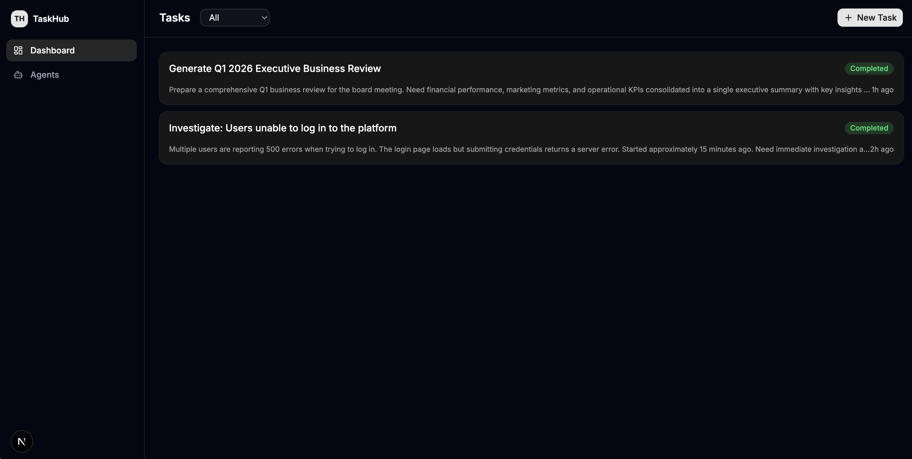
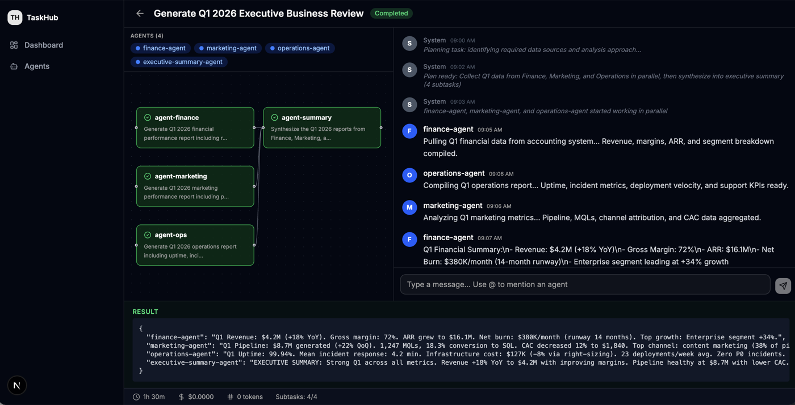
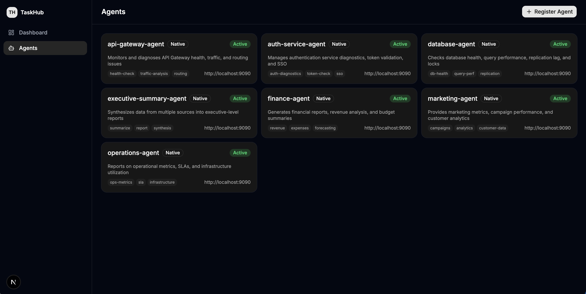

<p align="center">
  <h1 align="center">TaskHub</h1>
  <p align="center">
    <strong>Open-source AI agent orchestration platform.</strong>
    <br />
    <em>Kubernetes for AI Agents — orchestrate, manage, and govern agent workflows at scale.</em>
  </p>
  <p align="center">
    <a href="#quick-start">Quick Start</a> &bull;
    <a href="#features">Features</a> &bull;
    <a href="#architecture">Architecture</a> &bull;
    <a href="#agent-protocol">Agent Protocol</a> &bull;
    <a href="#contributing">Contributing</a>
  </p>
  <p align="center">
    
    
    
    
  </p>
</p>

---

TaskHub is an open-source platform for orchestrating AI agents across your organization. You describe what needs to be done — TaskHub decomposes it into a DAG of subtasks, routes them to the right agents, manages execution with retries and human-in-the-loop, and streams results back in real-time.

**TaskHub does not run agents.** It orchestrates them. Your agents live wherever they are — any HTTP service that can accept a task and return results can be plugged in via adapters, with zero code changes to your agent.

> **Community Edition** — This is the open-source community version of TaskHub, designed for single-workspace use. Organization-level multi-tenant agent orchestration (team management, RBAC, SSO, billing) is on the roadmap.



## Why TaskHub?

AI agents are everywhere, but running them in production is chaos:

- **Fragmented interfaces** — Every agent has a different API, input/output format, and lifecycle model
- **No control plane** — Which agents are running? Which one failed? Which one costs the most?
- **Manual orchestration** — Coordinating multi-agent workflows requires custom glue code
- **Stateful agents, stateless infra** — Long-running agent tasks need checkpointing, retry, and recovery
- **Zero governance** — No audit trail, no budget control, no access management

TaskHub solves this by providing a unified orchestration layer that works with any agent.

## Features

### Core

- **Agent Registry** — Register any external agent with a simple HTTP endpoint. No SDK required, no agent modification needed.
- **DAG Execution** — Tasks are automatically decomposed into subtask DAGs. Parallel when possible, sequential when dependent.
- **Adapter System** — Plug in any agent via configurable HTTP polling adapters or the native TaskHub protocol. JSONPath mapping for custom APIs.
- **Real-time Streaming** — SSE-based event stream with persistent event store. Browser auto-reconnect with zero event loss.

### Collaboration

- **Group Chat** — Every task gets a chat room. Agents and users communicate via @mentions.
- **Human-in-the-Loop** — Agents can pause execution and ask for confirmation. Users @reply in chat to continue.
- **DAG Visualization** — React Flow pipeline view showing subtask status, dependencies, and progress in real-time.

### Governance

- **Audit Trail** — Every LLM call and agent invocation is logged with token counts, latency, and cost estimates.
- **Budget Control** — Set monthly spend limits. Execution halts when budget is exceeded.
- **Credential Encryption** — Agent auth tokens encrypted at rest with AES-256-GCM.



*Task detail view: DAG pipeline visualization on the left showing parallel agent execution (finance, marketing, operations → executive summary). Group chat on the right with real-time agent messages and results.*



*Agent registry: 7 enterprise agents registered with capabilities, endpoints, and health status.*

## Architecture

```
User → Frontend (Next.js) → Backend API (Go/chi)
                                    │
                              ┌─────┴──────┐
                              │ Orchestrator │  ← LLM decomposes tasks into DAG
                              └─────┬──────┘
                                    │
                              ┌─────┴──────┐
                              │ DAG Executor │  ← Polls agents, manages lifecycle
                              └─────┬──────┘
                                    │
                    ┌───────────────┼───────────────┐
                    │               │               │
              ┌─────┴─────┐  ┌─────┴─────┐  ┌─────┴─────┐
              │  Agent A   │  │  Agent B   │  │  Agent C   │
              │ (your API) │  │ (your API) │  │ (your API) │
              └───────────┘  └───────────┘  └───────────┘
```

**Design principles:**

| Principle | Description |
|-----------|-------------|
| **Agents are external** | TaskHub orchestrates, it doesn't run agent code. Agents are HTTP services you own. |
| **Adapter pattern** | Any HTTP API can be an agent. Configure JSON request/response mapping — zero code changes to your agent. |
| **Event-sourced** | Every state change is persisted. Full replay, audit trail, and real-time SSE streaming. |
| **Temporal-ready** | The executor interface is designed to swap in Temporal for durable execution when needed. |

## Quick Start

### Prerequisites

- Go 1.22+
- Node.js 22+ and pnpm
- PostgreSQL 15+

### 1. Clone and install

```bash
git clone https://github.com/your-org/taskhub.git
cd taskhub
make install
```

### 2. Set up database

```bash
createdb taskhub
```

### 3. Start everything

```bash
# Terminal 1: Backend
make dev-backend

# Terminal 2: Frontend
make dev-frontend

# Terminal 3: Mock agent (for testing)
go run ./cmd/mockagent
```

Open **http://localhost:3000** — no login required in local mode.

### 4. Try it out

1. **Register an agent:** Go to Agents → Register Agent. Name: `mock-agent`, Endpoint: `http://localhost:9090`, Type: `Native`. Click Test Connection, then Register.
2. **Create a task:** Go to Dashboard → New Task. Describe what you want done.
3. **Watch it execute:** The orchestrator decomposes your task, assigns subtasks to agents, and streams results in real-time via the DAG view and group chat.

## Agent Protocol

### Option 1: Native Protocol (easiest)

Implement three endpoints on your agent:

```
POST /tasks              → Accept a task, return { "job_id": "..." }
GET  /tasks/{id}/status  → Return current status
POST /tasks/{id}/input   → Receive user input (optional)
```

Status response:

```json
{
  "status": "running",
  "progress": 0.65,
  "messages": [{"content": "Analyzing data..."}],
  "result": null
}
```

Status values: `running` | `completed` | `failed` | `needs_input`

### Option 2: HTTP Poll Adapter (zero agent changes)

Already have an API? Configure a JSON mapping when registering:

```json
{
  "submit": {
    "method": "POST",
    "path": "/v1/analyze",
    "body_template": { "prompt": "{{instruction}}" },
    "job_id_path": "$.id"
  },
  "poll": {
    "method": "GET",
    "path": "/v1/jobs/{{job_id}}",
    "status_path": "$.state",
    "status_map": { "processing": "running", "done": "completed" },
    "result_path": "$.output"
  }
}
```

TaskHub adapts to your API — your agent doesn't need to change anything.

## Tech Stack

| Layer | Technology |
|-------|-----------|
| Backend | Go, chi router, pgx (PostgreSQL) |
| Frontend | Next.js 15, React 19, Tailwind CSS 4, Zustand |
| Visualization | React Flow |
| UI Components | shadcn/ui |
| Database | PostgreSQL (13 tables, event-sourced) |
| Real-time | Server-Sent Events (SSE) |

## Project Structure

```
taskhub/
├── cmd/
│   ├── server/         # API server
│   └── mockagent/      # Mock agent for testing
├── internal/
│   ├── adapter/        # Agent adapters (HTTP poll, native protocol)
│   ├── audit/          # Audit logging + cost tracking
│   ├── auth/           # Authentication (local mode + OAuth ready)
│   ├── config/         # Environment configuration
│   ├── crypto/         # AES-256-GCM credential encryption
│   ├── db/             # PostgreSQL connection + migrations
│   ├── events/         # Event store + SSE broker
│   ├── executor/       # DAG execution engine + crash recovery
│   ├── handlers/       # HTTP request handlers
│   ├── models/         # Domain structs
│   ├── orchestrator/   # LLM-based task decomposition
│   ├── rbac/           # Role-based access control
│   └── seed/           # Local mode data seeding
├── web/                # Next.js frontend
├── Makefile            # Build, lint, test, dev commands
├── Dockerfile          # Multi-stage container build
└── CLAUDE.md           # AI-assisted development guidelines
```

## Development

```bash
make check    # Full quality gate: format + lint + typecheck + build
make test     # Run all tests
make lint     # Run golangci-lint + eslint
make fmt      # Format all code
```

## Roadmap

### Community Edition (current)

- [x] Agent Registry with HTTP poll + native adapters
- [x] DAG-based task execution with parallel subtasks
- [x] LLM-powered task decomposition (orchestrator)
- [x] Real-time SSE streaming with event persistence
- [x] Group Chat with @mention interaction
- [x] Human-in-the-loop (agent pauses for user input)
- [x] Audit logging + cost tracking + budget control
- [x] Mock agent for end-to-end testing
- [x] Local mode (zero-config, no auth needed)
- [ ] A2A protocol adapter
- [ ] WebSocket/streaming agent support
- [ ] Anthropic SDK integration (replace CLI)
- [ ] Capability-based automatic agent routing
- [ ] Session memory / conversation context

### Organization Edition (planned)

- [ ] Google/GitHub SSO authentication
- [ ] Multi-tenant organization management
- [ ] Team-based RBAC with agent-level permissions
- [ ] Organization-wide agent marketplace
- [ ] Cross-team agent sharing and governance
- [ ] Advanced policy engine (rate limiting, approval workflows)
- [ ] Cost allocation and chargeback per team
- [ ] Enterprise audit and compliance features

## Contributing

Contributions are welcome! Please see the [PR template](.github/pull_request_template.md) for guidelines.

```bash
# Fork, clone, then:
git checkout -b feat/my-feature
# Make changes, ensure quality gate passes:
make check
# Submit PR
```

## License

Apache License 2.0 — see [LICENSE](LICENSE) for details.
